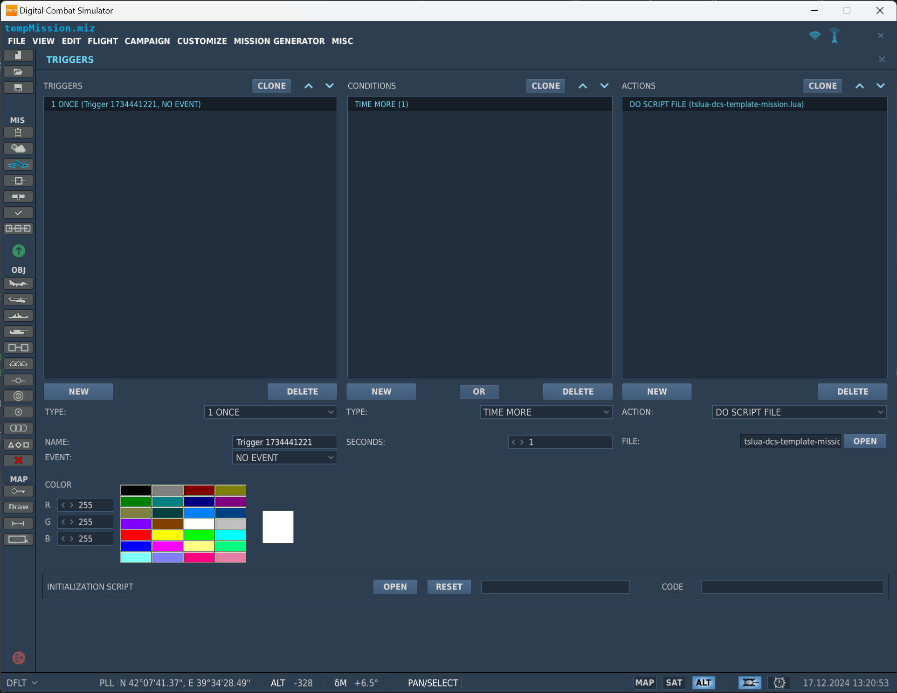

# tslua-dcs-template

This is a template for creating a new DCS script using the [tslua-dcs](https://tslua-dcs.pages.dev/) tooling.

**tslua-dcs** allows you to write **TypeScript** code for **DCS (Digital Combat Simulator)** scripting, leveraging TypeScript’s static typing, modern features, and robust tooling. It transpiles into **Lua**, providing improved developer productivity, reduced runtime errors, and enhanced code maintainability. With `tslua-dcs`, you can enjoy a modern development experience while integrating with DCS's Lua scripting APIs, making it ideal for creating reliable and scalable mission scripts.

## Features

1. **Static Typing**
    - TypeScript's static typing brings clarity and safety to Lua development, reducing runtime errors and making code easier to maintain.

2. **Modern Language Features**
    - TypeScript provides advanced features like interfaces, generics, and enums, which Lua lacks, enabling more structured and scalable code with strong type safety.

3. **Editor and Tooling Support**
    - Leverage TypeScript's robust tooling ecosystem: IntelliSense, autocomplete, and inline documentation, improving the developer experience.

4. **Code Reusability**
    - Reuse TypeScript code logic for Lua projects, avoiding duplication and ensuring consistency across different parts of the codebase.
    - Share code on NPM and reuse it across multiple projects.

5. **Strong Ecosystem**
    - Access TypeScript's rich ecosystem, enabling developers to use tools like linting, testing frameworks, and modern build pipelines.

## Getting Started

> For this project, you need to have the following installed:
> - Install [Node.js](https://nodejs.org/en/download/)
> - Install [GitHub Desktop](https://github.com/apps/desktop) or [GitHub CLI](https://cli.github.com/ ) or [Git](https://git-scm.com/downloads)

1. Use this template to create a new repository and pull it to your local machine using GitHub Desktop/CLI or Git.

2. Install dependencies

```bash
npm install
```

3. Build the scripts

```bash
npm run build
```

This will generate the `build` folder with the compiled Lua scripts.

## Testing

### Testing the GUI script

Inside the `build` folder you will find the following files:

- `build/tslua-dcs-template-gui.lua`: The GUI script
- `build/tslua-dcs-template-mission.lua`: The mission script

To test the GUI script place it in the `%USERPROFILE%\Saved Games\DCS\Scripts\Hooks` folder.

You should see the log message `Hello World!` in the DCS log file.

```text
2024-12-17 13:11:18.203 INFO    LuaHooks (Main): Hello, world! from the GUI!
```

### Testing the mission script

To test the mission script add it as a trigger action in the mission editor.


Add a ground unit to the mission and name it `Ground-1`.

You should see the log message `Hello World!` in the DCS log file.

```text
2024-12-17 13:15:36.034 INFO    SCRIPTING (Main): Hello, world! from the mission
2024-12-17 13:15:36.034 INFO    SCRIPTING (Main): Mission 1.801 load begin
2024-12-17 13:15:36.034 INFO    SCRIPTING (Main): Group: Ground-1
```

## Key Files

### `package.json`
This file contains metadata about the project, including its dependencies and scripts. It defines the build scripts for compiling the TypeScript code into Lua for both the GUI and mission environments.

### `tsconfig.gui.json`
This TypeScript configuration file is used to compile TypeScript code for the GUI environment of the DCS mod. It specifies the input files, compiler options, and TypeScript-to-Lua (TSTL) options for generating the Lua bundle for the GUI.

### `tsconfig.mission.json`
This TypeScript configuration file is used to compile TypeScript code for the mission environment of the DCS mod. It defines the input files, compiler options, and TSTL options for generating the Lua bundle for the mission.

### `src/gui/index.ts`
This is the entry point for the GUI script. From here, you can interact with the DCS GUI Lua API. 

See `C:\Program Files\Eagle Dynamics\DCS World\API\DCS_ControlAPI.html` for more information on the DCS GUI Lua API.

### `src/mission/index.ts`
This is the entry point for the mission script. From here, you can interact with the DCS mission scripting API.

See `https://www.digitalcombatsimulator.com/en/support/faq/scripting_engine/` for more information on the DCS mission scripting API.

### `src/common/index.ts`
This file exports a common message used in both the GUI and mission scripts, demonstrating code reuse between different parts of the project.

This should only contain code that is shared between the GUI and mission scripts and doesnt have access to the DCS API at all.

Examples of code that could be in here:
- Constants
- Utility functions
- Logging Classes

## Useful Resources

- **TypeScript-to-Lua (TSTL)** - [TypeScript-to-Lua (TSTL)](https://typescripttolua.github.io/)
   - The TSTL documentation explains how to transpile TypeScript code into Lua.

- **tslua-dcs** - [tslua-dcs](https://tslua-dcs.pages.dev/)
   - The tslua-dcs docs provide information on the APIs available for DCS scripting in TypeScript.

- **DCS Fiddle** - [DCS Fiddle](https://dcsfiddle.pages.dev/)
   - DCS Fiddle is an online tool for experimenting with DCS scripting. It allows developers to run their scripts and explore the LUA API, making it easier to develop and refine their code.

- **DCS World Scripting Engine Documentation** - [DCS World Scripting Engine Documentation](https://www.digitalcombatsimulator.com/en/support/faq/scripting_engine/)
   - This documentation provides comprehensive information on the scripting engine used in DCS World.

- **DCS World Mission Editor Documentation** - [DCS World Mission Editor Documentation](https://www.digitalcombatsimulator.com/en/support/faq/mission_editor/)
   - This resource offers detailed guidance on using the DCS World Mission Editor.

- **DCS World GUI Lua API Documentation** - `C:\Program Files\Eagle Dynamics\DCS World\API\DCS_ControlAPI.html`
   - This local documentation file provides information on the DCS GUI Lua API.

- **TypeScript Handbook** - [TypeScript Handbook](https://www.typescriptlang.org/docs/handbook/intro.html)
   - The official TypeScript Handbook is an excellent resource for learning TypeScript.

- **Lua Programming Language** - [Lua Programming Language](https://www.lua.org/manual/5.1/)
   - The official Lua manual provides detailed information on the Lua programming language. It is a vital resource for developers working with Lua, offering insights into the language's syntax, functions, and libraries.

## License

This project is licensed under the MIT License - see the [LICENSE](LICENSE.md) file for details.